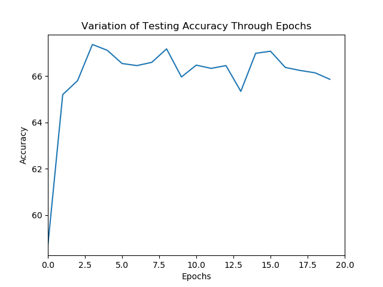
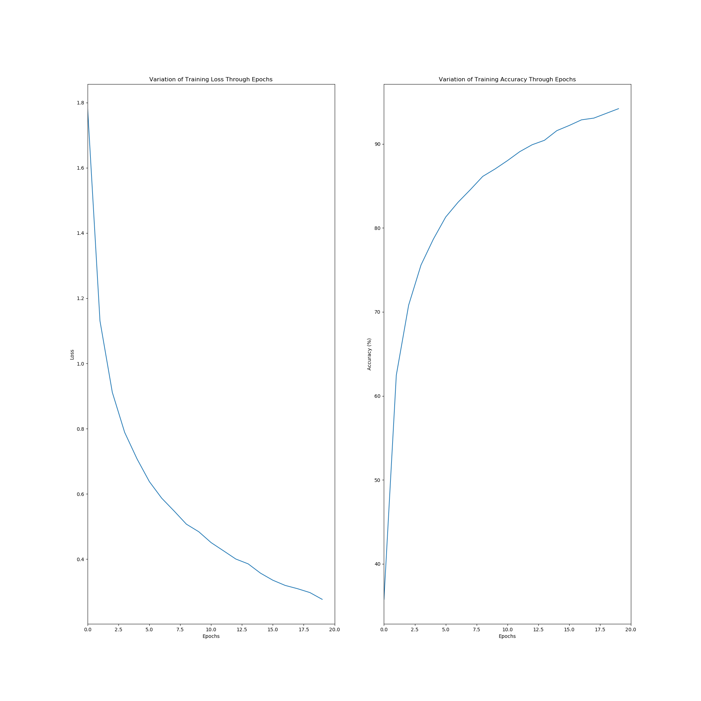

# Image-Classification-for-CIFAR-10

### Overview

Neural networks can present themselves in various architectures, each having a specialty of its own. Even minor changes in network architecture or other hyperparameters can have a significant effect on model performance. This section of the assignment focuses on developing, running, and comparing the performance of different convolutional neural network (CNN) models on classifying images from the CIFAR-10 dataset. The different model architectures discussed in this assignment include a basic CNN, an optimized CNN with more layers and batch normalization, a ResNet-based model, a ResNext-based model, and a DenseNet-based model. Each of these architectures is discussed and compared in the following sections.

### Model 1: A Basic CNN

The first network model implemented includes a basic CNN architecture with a set of convolutional and max-pooling layers followed by two fully connected layers after flattening the intermediate convolutional layers as can be seen below.

  

When trained over 20 epochs and tested, this model observes very high training accuracy with a comparatively lower testing accuracy indicating the presence of model overfitting. The training loss, training accuracy, and testing accuracy when trained and tested over 20 epochs with an Adam optimizer and softmax-cross-entropy loss and a learning rate of 0.0015 over a minibatch size of 64 is shown below.

  

  

Further, the confusion matrix displaying the correct and incorrect predictions over the training and testing set (in that order) is displayed below.

  

  

### Model 2: An Optimized CNN

The second model implemented includes an optimized version of the basic CNN used earlier. In this architecture, batch normalization is introduced to every second convolutional layer to better center the intermediate layer outputs. the network architecture of this model is shown below.

  

Further, the number of layers is almost doubled and the fully connected layer neurons are increased as well. When trained under similar conditions as the basic CNN, this model outputs negligibly less training accuracy with a higher testing accuracy indicating a lower amount of overfitting and higher overall performance. The training loss, training accuracy, and testing accuracy when trained and tested over 20 epochs with an Adam optimizer and softmax-cross-entropy loss and a learning rate of 0.0015 over a minibatch size of 64 is shown below.

  

  

Further, the confusion matrix displaying the correct and incorrect predictions over the training and testing set (in that order) is displayed below.

  

  

### Model 3: A ResNet-based CNN Architecture

This model is based on the ResNet architecture. Taking inspiration from ResNet’s skip connections, this network implementation includes two skip connection blocks (containing convolutional and max-pooling layers) followed by fully connected layers. The model architecture is desplayed below.

  

The skip connections aid in gradient flow and this can be verified with the highest training accuracy among all models though a slightly lower testing accuracy. The training loss, training accuracy, and testing accuracy when trained and tested over 20 epochs with an Adam optimizer and softmax-cross-entropy loss and a learning rate of 0.0015 over a minibatch size of 64 is shown below.

  

  

Further, the confusion matrix displaying the correct and incorrect predictions over the training and testing set (in that order) is shown below.

  

  

### Model 4: A ResNext-based Architecture

This model takes inspiration from the famous ResNext model architecture. It is similar to the ResNet architecture except for the fact that the skip connections are slightly modified to have two branches of the network running in parallel. These blocks can be visualized from the network architecture shown below.

  

This model gives an intermediate training accuracy with the best testing accuracy indicating the least amount of overfitting, a characteristic that can be attributed to it having the lowest number of trainable parameters among all the models. The training loss, training accuracy, and testing accuracy when trained and tested over 20 epochs with an Adam optimizer and softmax-cross-entropy loss and a learning rate of 0.0015 over a minibatch size of 64 is shown below.

  

  

Further, the confusion matrix displaying the correct and incorrect predictions over the training and testing set (in that order) is displayed below.

  

  

### Model 5: A DenseNet-based Architecture

The DenseNet-based model takes inspiration from inception modules where multiple filter sizes with constant padding are used and their outputs are concatenated as displayed below.

  

The implementation used in this assignment uses two inception blocks to get a high training accuracy and intermediate testing accuracy. The training loss, training accuracy, and testing accuracy when trained and tested over 20 epochs with an Adam optimizer and softmax-cross-entropy loss and a learning rate of 0.0015 over a minibatch size of 64 is shown below.

  

  

Further, the confusion matrix displaying the correct and incorrect predictions over the training and testing set (in that order) is shown below.

  

  

You can refer more mathematical and implementation details in `Report.pdf`.